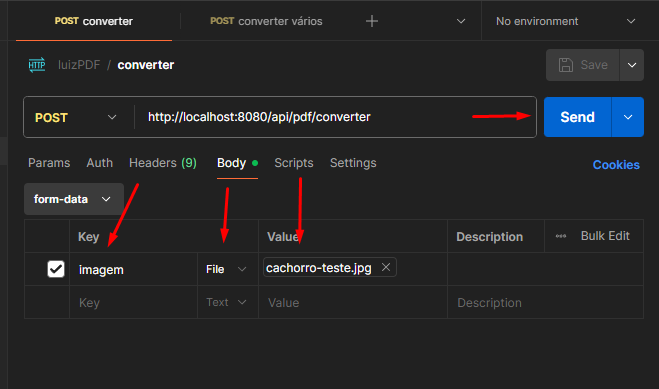
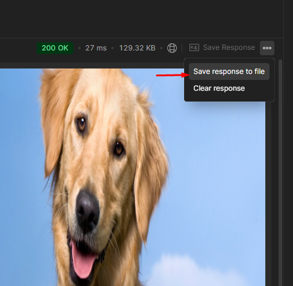
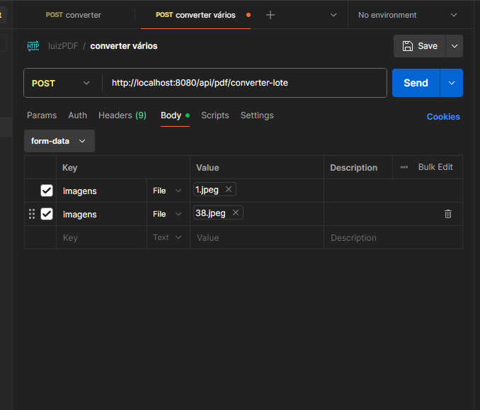

# LuizPDF

API desenvolvida em **Java + Spring Boot** para converter imagens em arquivos PDF.

A aplicação possui dois endpoints:

* Converter uma única imagem em PDF.
* Converter várias imagens em PDFs separados e retornar todos dentro de um arquivo ZIP.

## Tecnologias

* Java
* Spring Boot
* Maven
* Apache PDFBox

## Como executar

Clone o projeto e execute a aplicação Spring Boot.

Por padrão, a API ficará disponível em:

```text
http://localhost:8080
```

Você pode utilizar o **Postman** para realizar as requisições.

---

## 1. Converter uma imagem

### Endpoint

```http
POST /api/pdf/converter
```

URL completa:

```text
http://localhost:8080/api/pdf/converter
```

### Como enviar

No Postman:

1. Selecione o método `POST`.
2. Informe a URL do endpoint.
3. Acesse **Body → form-data**.
4. Crie um campo chamado `imagem`.
5. Altere o tipo do campo para **File**.
6. Selecione a imagem que deseja converter.
7. Clique em **Send**.

### Exemplo

```text
POST http://localhost:8080/api/pdf/converter

Body → form-data

imagem | File | foto.jpg
```

### Print do Postman


```text

```

### Resultado

A API retorna um arquivo PDF contendo a imagem enviada.

O arquivo pode ser salvo pelo Postman utilizando a opção de salvar a resposta.


```text

```

---

## 2. Converter várias imagens

Esse endpoint permite enviar várias imagens de uma vez.

Cada imagem será convertida em um **PDF separado** e todos os PDFs serão colocados dentro de um único arquivo ZIP.

### Endpoint

```http
POST /api/pdf/converter-lote
```

URL completa:

```text
http://localhost:8080/api/pdf/converter-lote
```

### Como enviar

No Postman:

1. Selecione o método `POST`.
2. Informe a URL do endpoint.
3. Acesse **Body → form-data**.
4. Adicione um campo chamado `imagens`.
5. Altere o tipo para **File**.
6. Selecione a primeira imagem.
7. Adicione outra linha com o mesmo nome `imagens`.
8. Continue adicionando as imagens desejadas.
9. Clique em **Send**.

### Exemplo

```text
POST http://localhost:8080/api/pdf/converter-lote

Body → form-data

imagens | File | 1.jpg
imagens | File | 2.jpg
imagens | File | 3.jpg
imagens | File | 4.jpg
```

**Importante:** todas as linhas devem utilizar o mesmo nome:

```text
imagens
```

Não utilize:

```text
imagem1
imagem2
imagem3
```

### Print do Postman


```text

```

### Resultado

A API retorna um arquivo:

```text
convertidos.zip
```

Dentro dele haverá um PDF para cada imagem enviada:

```text
convertidos.zip
├── 1.pdf
├── 2.pdf
├── 3.pdf
└── 4.pdf
```


```text

```

---

## Resumo dos endpoints

| Método | Endpoint                  | Entrada        | Retorno      |
| ------ | ------------------------- | -------------- | ------------ |
| `POST` | `/api/pdf/converter`      | Uma imagem     | PDF          |
| `POST` | `/api/pdf/converter-lote` | Várias imagens | ZIP com PDFs |

## Observação

A aplicação foi desenvolvida para **uso pessoal e local**, sem depender de serviços externos ou APIs pagas.
